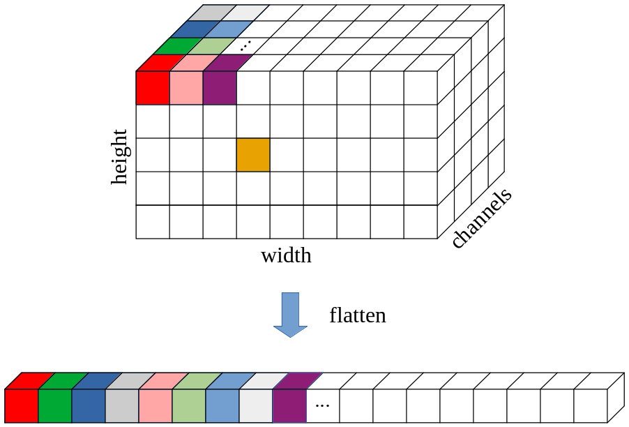

# The Need for Speed

In this second phase, we convert our image manipulation algorithms to C.

You will learn
* that programs in different programming languages can look almost the same
* how to allocate dynamic arrays on the heap and on the stack
* how multi-dimensional arrays are represented in the memory
* that C is a lot faster than Python

[[_TOC_]]


## Important Dates

| Date | Description |
|:---  |:--- |
| Monday, April 10 | Handout |
| Monday, May 1 | Submission deadline |

### Hand-out

Fork this repository into your namespace and make sure its visibility is set to private. Read the instructions here carefully, then clone your copy of the lab to your computer and get to work.

**Important:** Make sure to push your work to your private repository in your namespace and not the official handout. *Pushing code or merge requests to the handout will result in a 50-100% point reduction*. If you do not know how to use Git, look it up. Most Git commands support the `--dry-run` option that shows you what actions a command would perform without actually executing them.

### Submission

Commit and push your work frequently to avoid data loss. When you are ready to submit your code for grading, create a tag called "Submission". The timestamp of the "Submission" tag is considered your submission time.

To create a tag, visit the repository on GitLab and navigate to Repository -> Tags. Enter "Submission" as the Tag name then hit "Create tag". You can leave the other fields empty.

If you later discover an error and want to update your submission, you can delete the "Submission" tag, fix your solution, and create a new "Submission" tag. If that happens _after_ the submission deadline, you also need to email the TAs so that they are aware of the update to your submission.

### Coding Rules

In this lab, your work goes into the files `blur_float.c`, `blend_float.c`, `blur_int.c`, and `blend_int.c`. Also in this phase, you are not allowed to use any additional libraries and must not change the number of types of parameters passed to, or returned from the functions.

You can modify the other files of the handout to your liking, however, our grading system will evaluate only the four files mentioned above in a standard environment.


## Image Manipulation in C

Python has many advantages when used as a rapid prototyping language but is less suited for large projects or high-performance computing. While Python is the de-facto standard for machine learning and neural network frameworks, the libraries such as TensorFlow, PyTorch, Numpy, Pandas, or OpenCV are all written in C or C++. 

C (and C++), on the other hand, is the de-facto standard to implement system software. As an imperative, close-to-the hardware, and strongly-typed language the programmer has maximum control over the way the hardware is accessed. However, with great power comes great responsibility. With C, it is easy to shoot yourself in the foot.

### Data Representation

Since functions can only return one value in C, we cannot use the "Python way" and return the image data, height, width, and number of channels with a single return statement. 
```Python
    return blurred, bheight, bwidth, bchannels
```

Instead, the provided C image library `imlib.c/h` defines a struct that contains the relevant fields that define an image:
```C
typedef unsigned char uint8;

struct Image {
    uint8 *data;
    int height;
    int width;
    int channels;
};
```

The struct contains fields to store the height, width, and the number of channels of an image.
The image data, conceptually a 3-dimensional array of bytes with dimensions [height][width][channels] is stored as a flat (1-dimensional) array of `uint8` (=`unsigned char`) values. 

The flattening occurs along the axes height, width, and channels, in this order. The following illustration demonstrates the concepts:



The flattened array stores, from inner to outer dimensions, the data of the pixels (channel direction), the columns (width direction), and finally the rows (height direction). This format is called "row-major" layout and is the standard for almost all programming languages with the notable exception of Fortran.

### Indexed Array Accesses

Similar to the one-dimensional case, the location of an element in an n-dimensional array can be easily calculated. In our particular case, the offset of `image[h][w][c]` in the flattened array is given by
```math
\begin{align}
offset_{flat} &= c + w*CHANNELS + h * WIDTH*CHANNELS \\
              &= c + CHANNELS*(w + WIDTH*h)
\end{align}
```

The handout contains two macros (defined in `imlib.h`) that will help you with calculating the offset of an element in the flattened array and with reading/writing an element:
1. `INDEX(img, y, x, c)`  
   This macro computes the offset from the start of `img.data` to the element designated by coordinates [y,x,c].
1. `PIXEL(img, y, x, y)`  
   This macro accesses the element designated by coordinates [y,x,c] in the `img.data` array. Internally, it uses the `INDEX()` macro to compute the offset.
   The `PIXEL()` macro can be used for reading or writing the array, i.e.,  
   ```C
   PIXEL(img, y, x, c) = 73;
   ```
   and
   ```C
   uint8 v = PIXEL(img, y, x, c);
   ```
   are both valid.

### Explicit Dynamic Memory Allocation

Unlike Python, C programmers are responsible for memory management. Allocating memory is easy, (correctly) freeing memory a bit more complicated. 

When setting up the `struct Image` in the `blur()` and `blend()` functions, we need to generate and return a new image. The allocation of the struct and the assignment of the scalar fields is easy:

```C
  struct Image output;

  output.height   = ...;
  output.width    = ...;
  output.channels = ...;
```

The `data` field, however, has to be allocated dynamically. We can achieve this with the `malloc()` or the `calloc()` function that are both part of the C standard library. Read the man pages for both functions to learn what header file to include and how to call the functions.

```C
  output.data = (uint8*)malloc(...)
  if (output.data == NULL) abort();
```

Since dynamic memory allocations can fail (for example, if there is not enough free memory available), you *always* have to check the result of these functions. In our case, we are not really interested in gracefully handling the error, but rather forcefully terminate the program - which is still a lot better than a segmentation fault.

After you have allocated the data of an image as shown above, you can use the `PIXEL(output, y, x, c)` macro to read/write its elements.

Once we do not need a dynamically allocated memory block anymore, we should free it. This can be achieved with `free(output.data)`. For short-running programs such as our blend/blur drivers, freeing memory is not absolutely necessary.

### Implicit Dynamic Memory Allocation

If the compiler knows the dimensions of an array `A`, we can conveniently access the array with the square bracket notation `A[y][x]`. Since C99 (the [C standard first published in 1999](https://web.archive.org/web/20170428013610if_/http://www.open-std.org/jtc1/sc22/wg14/www/docs/n1256.pdf)), variable length arrays (VLAs) can be automatically allocated on the stack of a function. Another benfit of stack-allocated VLAs are that the compile will automatically deallocate them at the end of the function, so no explicit memory management is necessary.

The follwing code demonstrates the use of VLAs:
```C
void foo(int k)
{
  float kernel[k][k];

  for (int y=0; y<k; y++)
    for (int x=0; x<k; x++)
      kernel[y][x] = ...;

  ...
}
```


## Your Task

Your task is to implement the image blurring and image blending algorithms that you developed in phase 1 in the C language.

Again, we implement two variants of each operation
* a (standard) floating point variant
* a (faster) fixed-point integer variant

The handout contains the skeletons for both manipulations and variants (`blur_float.c`, `blur_int.c`, `blend_float.c`, and `blend_int.c`). Your code will only go into these functions. Similar to part 1, we provide driver programs that call your functions and an image library to read and write CSAP RAW images. 

A note on data types: CPython, the standard Python runtime, uses the `double` data type for floating-point computations. You are free to use `float` or `double` in your floating-point C code, but in the former case, the output of your C implementation may diverge slightly from the images generated by the Python implementation. 

Once you have finished your implementation, compare the performance of the Python implementation from phase 1 to your C code in phase 2. First, edit the `Makefile` in the root directory of this phase and switch from debugging code to optimized code by commenting out the fifth line and uncommenting line 3:
```Makefile
# C compile flags
# - performance
CFLAGS=-O2
# - debugging
#CFLAGS=-g

...
```

Now, rebuild your project:
```bash
$ make clean
$ make
```

Depending on the system load, the execution time of your algorithms may vary considerably. Execute each test case 5-10 times, drop the fastest and the slowest measurement, then take the arithmetic average for the C and the Python implementation. You can add your analysis to this README file right here.


## Results 
### blur 수행시간 평균

| language  | 301_512_3x3_float | 301_512_3x3_int | cat_512_7x7_float | cat_512_7x7_int | SNU_512_5x5_float | SNU_512_5x5_int |
|-----------|-------------------|-----------------|-------------------|-----------------|-------------------|-----------------|
| c         | 0.015722          | 0.013896        | 0.057921375       | 0.044523875     | 0.032573875       | 0.02623625      |
| python    | 3.91923625        | 4.04451375      | 14.65772588       | 15.13322325     | 8.50935275        | 8.2675572       |
| python/c  | 249               | 291             | 253               | 339             | 261               | 315             |

### blend 수행시간 평균

| Language | 301_512_SNU_512_merge_0.5_float | 301_512_SNU_512_merge_0.5_int | 301_512_SNU_512_overlay_0.1_float | 301_512_SNU_512_overlay_0.1_int | 301_512_SNU_512_overlay_0.5_float | 301_512_SNU_512_overlay_0.5_int | 301_512_SNU_512_overlay_0.8_float | 301_512_SNU_512_overlay_0.8_int |
|----------|---------------------------------|-------------------------------|-----------------------------------|---------------------------------|-----------------------------------|---------------------------------|-----------------------------------|---------------------------------|
| c        | 0.005573625                     | 0.00216225                    | 0.003073125                       | 0.001377875                     | 0.00306625                        | 0.0014585                       | 0.003039625                       | 0.001296875                     |
| python   | 1.027546875                     | 1.143156625                   | 0.9267465                         | 0.658541625                     | 0.962419375                       | 0.725505625                     | 1.041275                          | 0.72512225                      |
| python/c | 184                             | 528                           | 301                               | 477                             | 313                               | 497                             | 342                               | 559                             |

### int와 float 비교 : float type의 평균실행시간을 int type의 평균실행시간으로 나눈 것

| Language | 301_512_3x3 | cat_512_7x7 | SNU_512_5x5 | 301_512_SNU_512_merge_0.5 | 301_512_SNU_512_overlay_0.1 | 301_512_SNU_512_overlay_0.5 | 301_512_SNU_512_overlay_0.8 |
| -------- | ------------ | ----------- | ----------- | ------------------------ | -------------------------- | -------------------------- | -------------------------- |
| c        | 1.131404721  | 1.300905975 | 1.241559865 | 2.577696844              | 2.230336569                | 2.102331162                | 2.343807229                |
| python   | 0.969025325  | 0.96857924  | 1.029246305 | 0.89886797               | 1.407270953               | 1.326549846               | 1.43599924                |


## Analysis
위 3개의 table들을 비교하면 크게 아래 2개의 결론을 내릴 수 있다.

1. 파이썬에 비해 c언어가 빠르다. 
   위 2 table의 3번째 row를 보면, python의 평균 시간을 c의 평균 시간으로 나눈 값을 나타냈다. 
   최소 100배에서 최대 500배 이상 속도 차이가 나는 것을 볼 수 있다. 그 이유에는 여러 가지가 있는데, 대표적인 이유는 다음과 같다.
   1) 파이썬은 인터프리터 언어로 동작하는 반면, C 언어는 컴파일러를 통해 기계어로 번역되어 실행되기 때문이다.
   2) 파이썬은 c언어와 달리 동적 타입 언어이다. 파이썬은 변수의 타입을 런타임에 결정하는 반면, C 언어는 정적 타입 언어로, 컴파일 시간에 변수의 타입이 결정되기 때문에 더 빠르다.
   3) 파이썬은 C언어에 비해 높은 추상화 수준을 가진다. 파이썬은 다양한 기능과 라이브러리를 제공하지만, 이로 인해 실행 시간에 추가적인 오버헤드가 발생할 수 있습니다. 
      반면 C 언어는 하드웨어에 가까운 저수준의 프로그래밍 언어이다.
2. float에 비해 int type 연산이 빠르다.
   3번째 table은 image blur/blend를 float type으로 했을 때의 실행속도를 비교한 것이다.
   python에서는 몇몇 예외사례가 보이긴 하지만, 전체적으로 보았을 때, int type으로 실행했을 때가 float type으로 실행했을 때보다 빠른 것을 알 수 있다.
   그 이유에는 여러 가지가 있을 수 있지만, 한 가지 이유는 부동소수점 연산이 복잡하기 때문이다. 
   float 연산은 부동소수점 연산을 사용하는데, 이는 rounding 등등의 이슈로 인해 integer 연산보다 훨씬 복잡해 연산에 더 많은 시간이 소요된다.


<div align="center" style="font-size: 1.75em;">


**Happy coding!**
</div>
